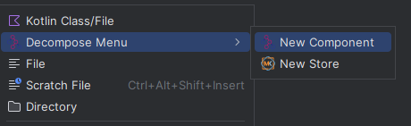

## MVIKotlin-Decompose-Plugin

MVIKotlin-Decompose-Plugin will help you to create Decompose components and MVIKotlin stores without wasting too much
time

Found bug or need a new feature? Please submit a

- [💀 Bug report](https://github.com/makeevrserg/MVIKotlin-Decompose-Plugin/issues/new?assignees=makeevrserg&labels=bug&projects=&template=bug.md&title=)
- [👾 Feature request](https://github.com/makeevrserg/MVIKotlin-Decompose-Plugin/issues/new?assignees=makeevrserg&labels=enhancement&projects=&template=feature.md&title=)

### Decompose/MVIKotlin template

Right-clicking on package will show additional dialog, with which you will be able to create Component or Store

### Menu overview

  
<b>(Click to expand)</b> Creation menu

    

        
    

### Create Decompose component

Here you can also make few configurations:

- [x] Choose an option to enable MVIKotlin integration, which will add store creation

This configuration will create following:

- `[Feat]Component` - Decompose interface component with Model
- `Default[Feat]Component` - Default component implementation with ComponentContext

  
<b>(Click to expand)</b> Decompose menu

    

        
    

### Create MVIKotlin store

Here you can also make few configurations:

- [x] Choose aBootstrapper type
- [x] Option to use klibs.kdi Factory

This configuration will create following:

- `[Feat]Store` - MVIKotlin store with State, Intent, Message, Label and Action if Bootstrapper was selected
- `[Feat]Executor` - MVIKotlin CoroutineExecutor
- `[Feat]Reducer` - MVIKotlin Reducer<State, Message>
- `[Feat]StoreFactory` - Store factory with private inner implementation
- `[Feat]Bootstrapper` - Store Bootstrapper if Custom bootstrapper option was selected

  
<b>(Click to expand)</b> MVIKotlin menu

    

        
    

### See libraries

- [Decompose](https://github.com/arkivanov/Decompose)
- [MVIKotlin](https://github.com/arkivanov/MVIKotlin)

### Gratitude

- [jetpack-compose-ui-arch-plugin](https://github.com/levinzonr/jetpack-compose-ui-arch-plugin) for inspiration
- [arkivanov](https://github.com/arkivanov) for great libraries
- [jetbrains](https://jetbrains.com) for IntelliJ 